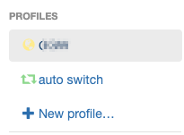
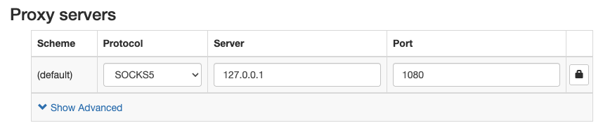
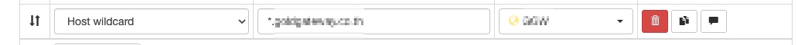
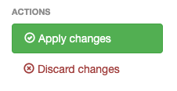

# Proxy Menubar

Native macOS menubar app that manages a single SSH SOCKS5 proxy tunnel.
Single Swift file, no Xcode required — builds with `swiftc` directly.

## How It Works

Runs `ssh -D 1080 -N -v <host>` in the background. Polls port 1080 until the tunnel accepts connections, then flips the icon to 🟢. On disconnect or crash, sends a macOS notification and reverts to 🔌.

The target SSH host is hardcoded as `"gitlab"` in `ProxyMenubar.swift:11`. Change `proxyHost` there to point at a different host. The host must have a matching entry in `~/.ssh/config` (including any `ProxyCommand` for bastion/SSM hops).

## Requirements

- macOS 11+
- Xcode Command Line Tools: `xcode-select --install`

## Build

```bash
bash build.sh
```

Produces `ProxyMenubar.app` — self-contained, ad-hoc signed, no runtime needed.

## Install

```bash
# Run from project folder
open ProxyMenubar.app

# Or install to Applications
cp -r ProxyMenubar.app /Applications/
open /Applications/ProxyMenubar.app
```

The 🔌 icon appears in the menubar. No terminal needed after that.

## Usage

| Menu Item | Action |
|-----------|--------|
| `Status: ...` | Current connection state (non-clickable) |
| **Enable Proxy** / **Disable Proxy** | Toggle tunnel on/off |
| **Show Logs** (`l`) | Open live SSH verbose log window |
| **Quit** (`q`) | Disconnect and exit cleanly |

### Menubar Icons

| Icon | State |
|------|-------|
| 🔌 | Disconnected |
| ⚪ | Releasing port / Connecting |
| 🟢 | Connected |

### SOCKS Proxy Settings

Configure your browser or system proxy to:

- **Type**: SOCKS5
- **Host**: `127.0.0.1`
- **Port**: `1080`

Test: `curl --socks5 localhost:1080 https://example.com`

### Browser Setup (Proxy SwitchyOmega)

For a better experience, it is recommended to use [Proxy SwitchyOmega v3](https://chromewebstore.google.com/detail/proxy-switchyomega-v3/hihblcmlaaademjlakdpicchbjnnnkbo) to manage proxy switching automatically.

#### Setup Instructions:

1. **Create Profile**: Create a new profile with any name (e.g., `Proxy-Tunnel`).<br>
   

2. **Configure Proxy**: Set the protocol to **SOCKS5**, server to `127.0.0.1`, and port to `1080`.<br>
   

3. **Auto Switch Rules**: Go to the **"auto switch"** profile:
   - Set **Condition type** as **"Host Wildcard"**.
   - Set **Condition details** as `*.<your-preferred-domain>`.
   - Select the previously created profile as the result.<br>
   

4. **Apply Changes**: Click **"Apply Changes"** in the actions section.<br>
   

## Configuration

Edit `ProxyMenubar.swift` line 11 to change the target host:

```swift
private let proxyHost = "gitlab"   // ← change this
```

Then rebuild and reinstall.

The host name must match a `Host` entry in `~/.ssh/config`. Example:

```
Host gitlab
    HostName your-server.example.com
    User ec2-user
    ProxyCommand aws ssm start-session --target %h --document-name AWS-StartSSHSession --parameters portNumber=%p
```

## Troubleshooting

| Issue | Fix |
|-------|-----|
| Port 1080 stuck in use | App kills the orphan automatically on next connect. Manual: `lsof -ti :1080 \| xargs kill -9` |
| Tunnel drops immediately | Click **Show Logs** — likely AWS SSO expired: `aws sso login --profile <profile>` |
| macOS blocks unsigned app | `xattr -cr ProxyMenubar.app` |

## Rebuild After Code Changes

```bash
bash build.sh
cp -r ProxyMenubar.app /Applications/
```

Kill the old instance first or just Quit from the menubar.

## Uninstall

```bash
bash uninstall.sh
rm -rf /Applications/ProxyMenubar.app
```
